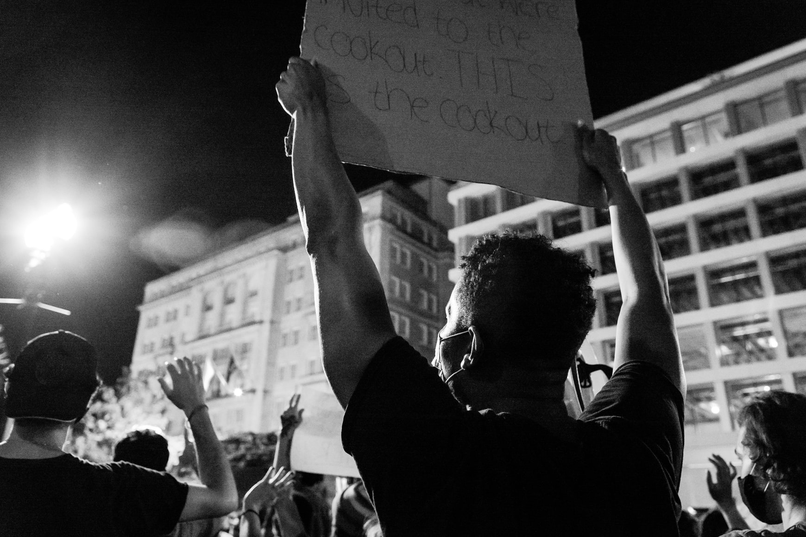
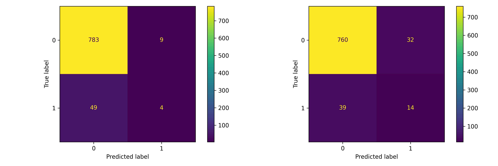
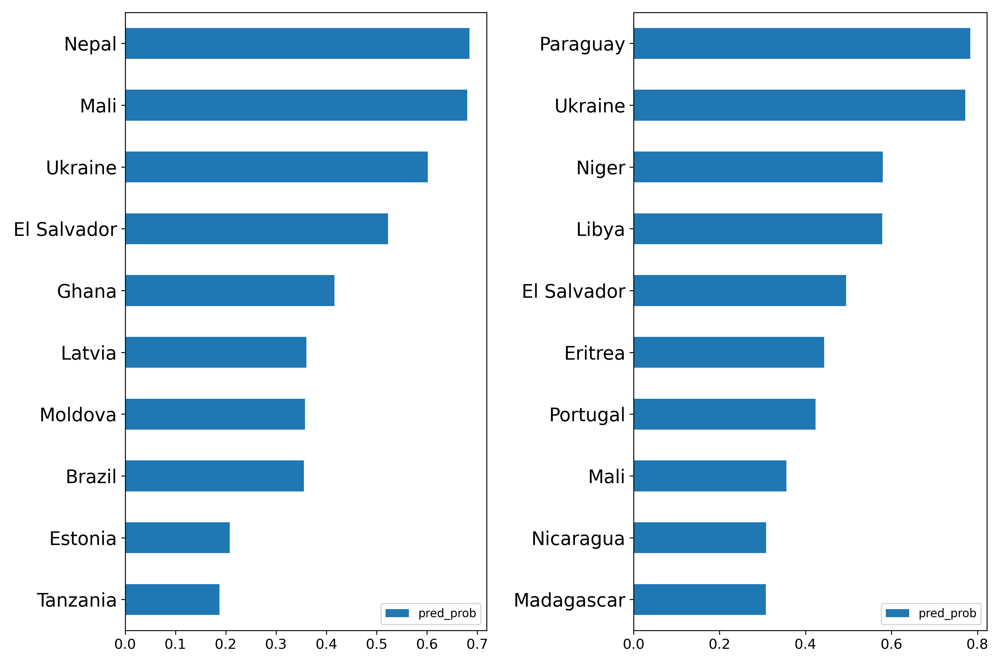
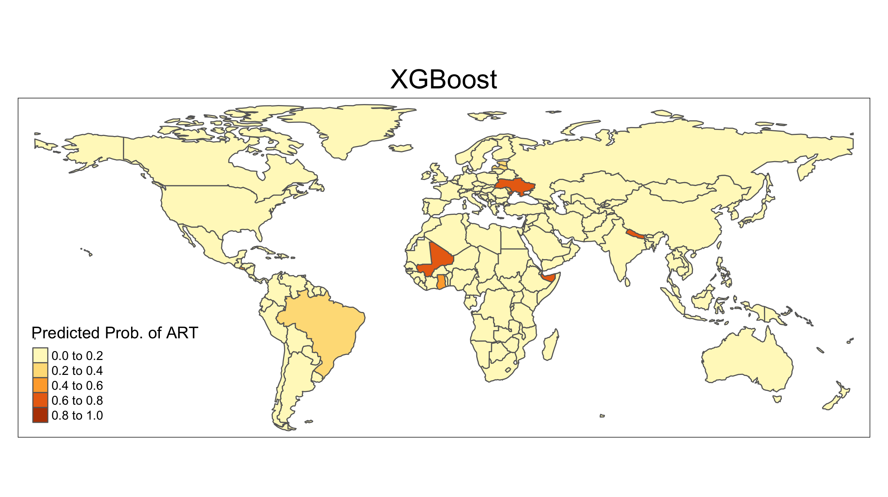
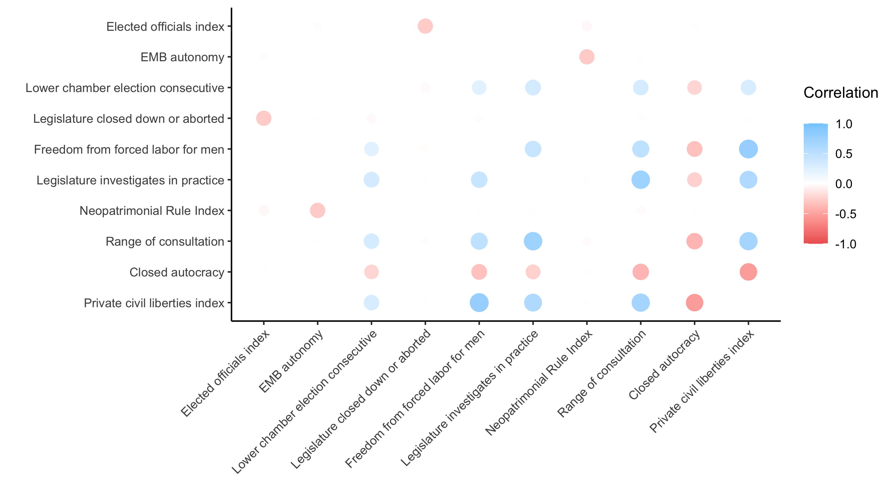

```{r setup, include=FALSE}
knitr::opts_chunk$set(echo = FALSE)
library(magick)
```

```{r democracy, echo = FALSE, fig.show = "hold", fig.align = "center"}

```

For much of the last 30 years, liberal democracy as we know it has been on the decline around the world. In recent years, regimes that for a long time appeared to steer toward liberal democracy have experienced democratic setbacks. Countries as diverse as Turkey, Mali, Brazil, Russia and Poland have accelerated a wave of autocratization we continue to witness today. During Covid-19, excessive use of emergency powers and limitations on media freedoms have put democratic principles further at risk. 2021 came with a record number of 33 countries autocratizing in the last 50 years, especially in Asia-Pacific, Eastern Europe, and Central Asia.

The decline of liberal democracy has emerged as one of the most pressing challenges of the 21st century. But is there anything we can do about it or are we damned to bear witness to the disintegration of our liberal democratic systems? Above all, engagement to protect and promote democracy must build on a better understanding of the challenges to democratic systems. Which factors - political, economic, societal or transnational - are driving the trend towards autocratization? Which countries are most at risk of adverse regime transitions in the future?

## Predicting regime transitions with data

Regime changes are not a new phenomenon. Over the past decades, experts in political science have strengthened our understanding of regime transitions, its causes and effects [@morgan2019varieties]. But what lessons can we draw for the future of democracy? How can we use existing work to help prevent autocratic regime changes in the future? Machine learning - that is, training models to transform data into actionable insights - bears the potential to contribute to such a solution. If we knew where democratic backsliding is likely to occur next, we could be in a better position to target our efforts and resources to protect and promote democratic principles. Instead of spreading unfit band-aids globally we could apply a real effort where it would be most effective. With the right data and model, machine learning can be a powerful tool for making such predictions. For this purpose, we develop a forecasting model that predicts regime changes towards autocratic systems and identifies countries most at risk of autocratization.

## Our data

So far so good. Then, how do we get these predictions? In order to make projections for the future, we first need data from the past that measures trends of democracy and autocracy for a large number of countries over an extended period of time. The data we use are based on a data set provided by the Varieties of Democracy Institute in Gothenburg, Sweden, which includes more than 430 indicators of democracy for 169 countries from 1970 until 2021.

The variables we include range from electoral features, such as whether elections are held freely and fairly, measures of rule of law and civil liberties to the level of equal access to resources and freedoms across societal groups. In addition to regime-related variables, we control for key features such as GDP and population, ethnic power relations and armed conflict. This gives us a very solid foundation with more than 50 years worth of already processed data. In a first step toward good practice in ML, we split our data set into a training set from 1970 until 2015 and a testing set that includes observations from 2016 until 2020. Now, what next?

## Our approach

Machine learning offers a seemingly endless world of opportunities to model our data. That's why it became even more important for us to select models and evaluation methods that are especially suitable for the challenges and characteristics of our data: First, the imbalanced nature of our variable of interest (regime transitions are rare events: we have 335 regime changes vs. close to 7,700 country-year observations without one in our data set). And second, the time-series structure of our data. We therefore need a binary classification model that not only predicts whether a regime change toward autocracy will occur in a given year, but also one that is able to respect the temporal hierarchy of our past data to predict future trajectories.

Taking our data structure into close consideration, we opted for a so-called gradient boosting model [@chen2016xgboost] as well as a support vector machine model [@kuo2013kernel]. In short, XGBoost is a decision tree-based gradient descent optimization algorithm that is predominant in many ML applications and competitions of today. The SVM model with a so-called radial basis function kernel is a more traditional model well-suited for imbalanced data structures such as ours. For both models, we used randomized hyperparameter tuning to find the optimal model parameters.

To validate our model, we combine k-fold cross-validation with walk-forward validation in a novel approach in ML-based social science. In walk-forward validation, we first test the model on a split at the temporal beginning of the data set and then 'walk forward' along a timeline of splits while learning and improving the model. This adjustment reduces overfitting and ensures to respect the temporal hierarchy of the data. To evaluate our model performance, we use established evaluation metrics that are particularly suited for imbalanced data such as balanced accuracy, the F1 score and AUC-ROC (which cryptically stands for area-under-the-curve receiver operating characteristic curve). Finally, in order to be able to generalize our findings for unknown data, we test our models on our testing data from 2016 until 2020.

## Results

So, how did our models do? Despite being rare events, both models were able to predict regime transitions with good precision in our cross-validation sets as well as in the test forecasts. In our walk-forward validation set, both models produced very similar scores for balanced accuracy, AUC-ROC and F1. Interestingly, when we tested our models on the testing set, the SVM model performed significantly better than the XGBoost model. Figure 1 shows the confusion matrices for both models, illustrating correct and false predictions made by each model for the test data.

```{r cm, echo = FALSE, fig.show = "hold", fig.align = "center", fig.cap = "Confusion Matrices: XGBoost (left), SVM (right)"}
image_write(
  image_append(
    c(
      image_read("figures/cm_xgb.png"),
      image_read("figures/cm_svm.png")
    )
  ),
  "figures/cm_both.png"
)


```


## Analysis

Now, what do these results tell us about the future of democracy? As an example of a test forecast, we calculated the estimated risk of an adverse regime transition for each country in the year of 2021. Figure 2 illustrates the top ten countries with the highest predicted probabilities of a regime change toward a more autocratic system in 2021 from each of our two trained models.


```{r top10, echo = FALSE, fig.show = "hold", fig.align = "center", fig.cap = "Countries with highest risk of ART, 2021 - XGBoost (left), SVM right)"}
image_write(
  image_append(
    c(
      image_read("figures/risk_forecast_top10_2021_xgb.png"),
      image_read("figures/risk_forecast_top10_2021_svm.png")
    )
  ),
  "figures/risk_forecast_top10_2021.png"
)


```

More broadly, the world map in Figures 3 and 4 show the distribution of risk estimates for all countries that we had data available for in the year 2021.

```{r xgbmap, echo = FALSE, fig.align = "center", fig.cap = "World map showing predictions, 2021 - XGBoost"}

```

```{r svmmap, echo = FALSE, fig.align = "center", fig.cap = "World map showing predictions, 2021 - SVM"}
knitr::include_graphics("figures/plot_2021_svm.png")
```

Equally interesting, how did these models actually come to these projections? Out of more than 430 features, which were most important in making these predictions? And what lessons can we draw for policies in democracy promotion in order to focus efforts on more effective targets? For this, we investigated the importance of features in our XGBoost model, i.e. which features received the most weight in the decision tree (note: this method is not available for SVM). Figure 5 shows the correlations of the 10 most important features of our XGBoost model. While there are strong correlations between many features, the three most important features - *Elected officials index*, *EMB autonomy* and *Lower chamber election consecutive* - are not correlated. Since all of them are related to electoral procedures, we can infer that they all point out distinct electoral dimensions in our model framework.

```{r featcorr, echo = FALSE, fig.align = "center", fig.cap = "Feature importance correlogram, XGBoost"}

```

## Conclusion

To sum up, we developed a forecasting model that predicts the risk of regime transitions toward more autocratic systems of governance in the future. Our project was driven by a vision to improve the understanding of the global challenges to democracy the world community is facing today. For this purpose, we used a state-of-the-art design in applied ML research that leveraged a comprehensive data set on democracy - Varieties of Democracy - to predict where the next anti-democratic development is likely to take place. To generate valid results, we followed a tailored model selection (XGBoost and SVM with a kernel trick) and nuanced evaluation approach (F1 score among others) that carefully considered the temporal hierarchy and imbalanced structure of our data. While our models performed above expectations, our project concludes with a number of ideas for further adjustments in the future. This includes the application of SMOTE (Synthetic Minority Over-sampling TEchnique) to account for imbalanced data and combining supervised learning methods with unsupervised ones to identify patterns. 

Last, but not least, questions of democracy and autocracy raise sensitive questions of ethics in ML (for example how autocratization predictions could be misused to spread disinformation). In this blogpost, while we do not have the scope to discuss potential ethical implications, we hope that experts and practitioners alike will engage in such important discussions in the future.


